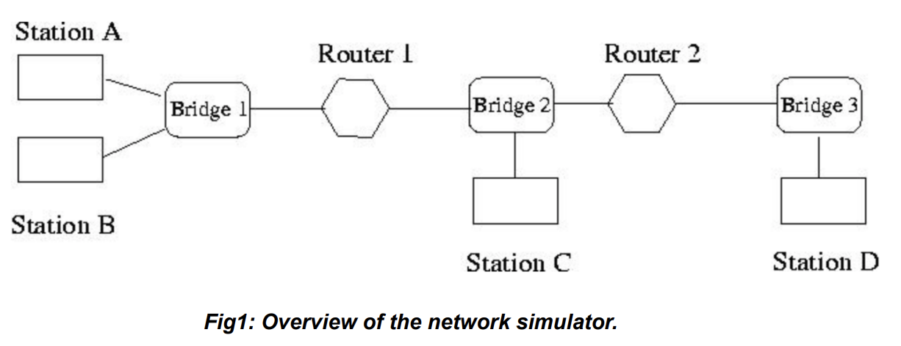
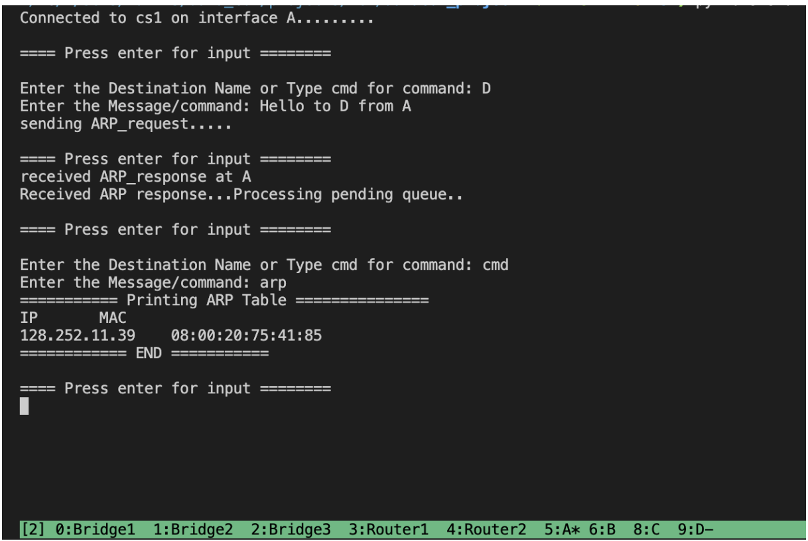
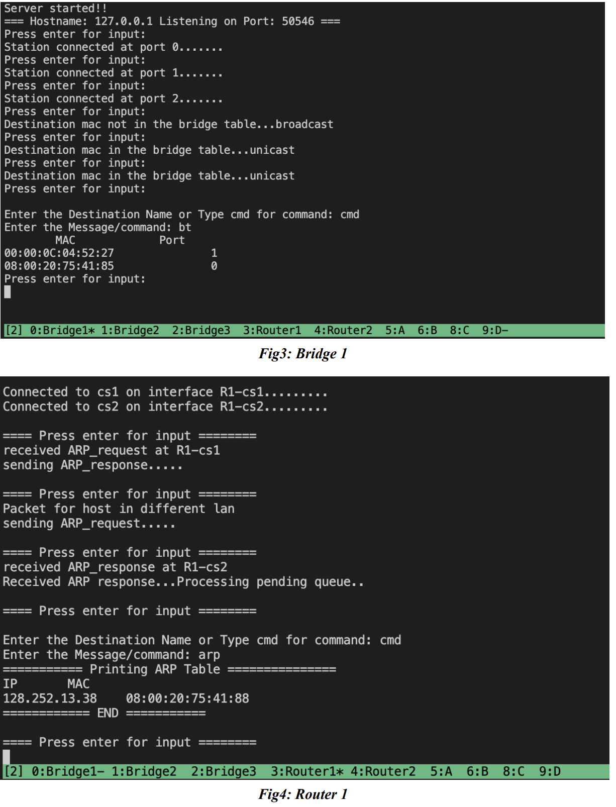
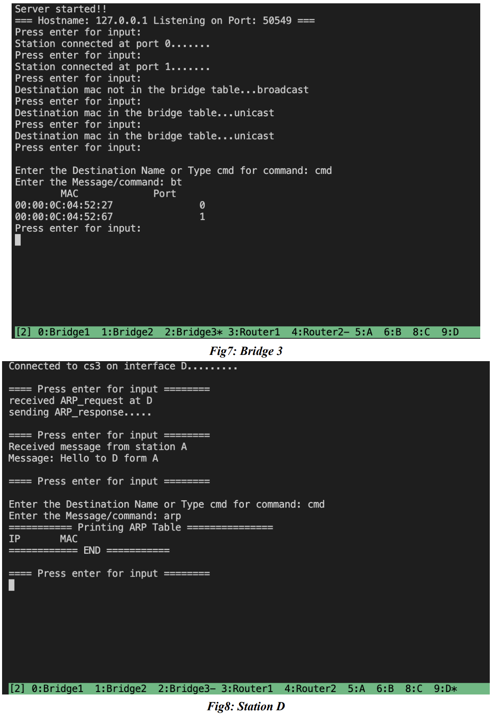

# Simple Network Emulator

## Project Description

The designed network emulator supports layer 2 and layer 3 of the OSI(Open System Interconnection) Network Model. The project is based on the star topology and supports any number of routers, bridges, and stations. The implemented features are:

### Bridge
1. Bridge table to record MAC:port mapping of the station when it first receives the data frame from that station.
2. Periodic removal of inactive entries from the bridge table.
3. Broadcasts ARP request messages to connected devices.

### Routers
1. Each router has a static routing table loaded from the configuration file.
2. Performs hop-by-hop IP packet forwarding based on the routing table

### Stations
1. Communicate with one another through message passing.

### ARP
1. ARP(Address Resolution Protocol): To discover the link layer's Media Access Control(MAC) address associated with the device's IP address.
2. Each router and station maintains its ARP(Address Resolution Protocol) cache and routing table.
3. The project supports MAC address discovery of the destination through ARP request and response.

### Links
1. For connecting different network components.

## Implementation Details
1. TCP sockets are used to realize bridges, routers, stations, and links among them. TCP is reliable, connection-oriented, and ensures full duplex communication.
2. The emulator is based on the client-server socket programming paradigm.
3. Bridge is implemented as the server.
4. Station/Router is implemented as a client.
5. TCP socket connection ensures the physical link between devices.
6. The configuration of each bridge, station, and router is loaded from a pre-configured JSON file. Each devices are given a name.
7. A TCP socket, ready to accept connections, is created as the bridge starts. Its name, IP address and port number are saved in a file.
8. Every time a station/router is connected to a bridge, the bridge keeps its record. Similarly, the station/router obtains the bridge's IP and port from the saved file(see 7).
9. As long as there is a link between two devices, they can communicate.
10. The sender encapsulates its message in the IP packet. The IP layer also obtains the MAC address of the next-hop router or the destination station(if in the same LAN). Then, the packet is passed to the layer 2. 
11. The receiver can receive two types of frames:  ARP packet(request or response) and an IP packet.
    1. If the packet is an ARP request packet, the receiving station checks if the packet's destination address is its IP address. If true, it stores the mapping between the sender's IP and MAC address in its ARP table. Moreover, it also sends an ARP reply packet to the sender.
    2. If the packet is an ARP reply packet, the sender's IP and MAC address are recorded receiver's ARP table.
    3. If the packet is an IP packet, the receiver displays the contained message if it is the intended receiver; otherwise, the packet is dropped.

## Configuration Files
These files are saved in **ifaces** and **rtables** folders. Pre and correct configuration is necessary to run the project.

## Example scripts to run the project:
- python bridge.py cs1 8  (creates a bridge named cs1, which has a maximum of 8 ports)
- python bridge.py cs2 8
- python bridge.py cs3 8
- python station.py -route ifaces/ifaces_r1.json rtables/rtable_r1.json hosts.json (creates a router, loads its configurations from the JSON files, note flag -route for the router)
- python station.py -route ifaces/ifaces_r2.json rtables/rtable_r2.json hosts.json
- python station.py -no ifaces/ifaces_a.json rtables/rtable_a.json hosts.json (creates a station, loads its configurations from the JSON files, note flag -no for the station)
- python station.py -no ifaces/ifaces_b.json rtables/rtable_b.json hosts.json
- python station.py -no ifaces/ifaces_c.json rtables/rtable_c.json hosts.json
- python station.py -no ifaces/ifaces_d.json rtables/rtable_d.json hosts.json

## Additional device commands:
In the terminal, type cmd then 
### For Bridge
Bridge supports two commands:
1. bt: Shows IP: MAC mapping saved in the bridge table
2. tt: Shows the time remaining for the saved entries in the bridge table to expire.

### For Router/Station
Router/Station supports following commands:
1. rt: Printing routing table
2. dns: Printing DNS table
3. arp: Printing ARP table

## Other features
1. When a station/router/bridge gets killed, the TCP connection is closed, and all allocated memory is cleared

## Sample Demo

